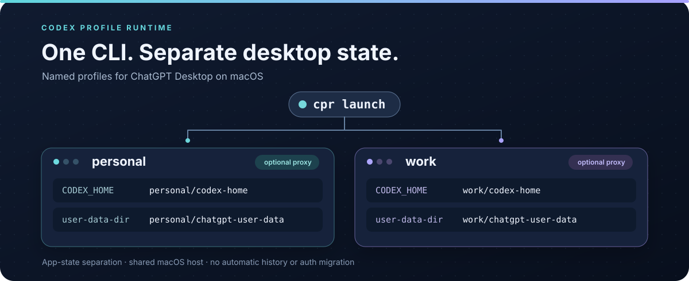

# Codex Profile Runtime

**一台 Mac，多个 ChatGPT 桌面 profile，各自使用独立的应用状态。**<br>
**One Mac. Multiple ChatGPT Desktop profiles, each with its own app state.**

[简体中文](README.zh-CN.md) · [English](README.md) · [下载版本](https://github.com/Luaphes/codex-profile-runtime/releases) · [MIT 许可证](LICENSE)



`cpr` 是一个小型 macOS 命令行工具，用于按名称启动、查看和安全停止 ChatGPT 桌面实例。每个 profile 都有自己的 `CODEX_HOME`、Electron `--user-data-dir` 和可选代理。它隔离的是应用状态，不是 macOS 系统级沙箱，也不负责切换应用内账号。

```text
cpr launch personal    cpr launch work    cpr list
```

## 它能做什么

`cpr` 把已验证的多 profile 启动方式收敛为一个小型 CLI：

- 同时运行多个 ChatGPT 桌面实例；
- 为每个 profile 派生独立的 `CODEX_HOME` 和 Electron `--user-data-dir`；
- 可为每个 profile 设置代理；
- 从实时进程表识别正在运行的 profile；
- 核对进程身份后，保守地停止指定 profile。

这是一个运行时管理工具，不替代 Codex，也不替代 ccSwitch。

## 环境要求

- macOS；
- 已安装官方 `ChatGPT.app`，默认路径是 `/Applications/ChatGPT.app`；
- 如需从源码构建或运行测试，需 Go 1.23 或更新版本；
- 实时进程识别和停止功能依赖 macOS 的 `libproc` 与 cgo。

非 macOS 系统仍可构建 CLI 并运行测试，但进程识别和发送信号会明确返回“不支持此平台”。

## 安装

从[最新 GitHub Release](https://github.com/Luaphes/codex-profile-runtime/releases/latest)下载适合 Mac 的二进制文件和 `SHA256SUMS`：Apple Silicon 选 `cpr_darwin_arm64`，Intel 选 `cpr_darwin_amd64`。下面以 Apple Silicon 为例：

```bash
asset=cpr_darwin_arm64 # Intel Mac 请改为 cpr_darwin_amd64
curl -fLO "https://github.com/Luaphes/codex-profile-runtime/releases/latest/download/$asset"
curl -fLO https://github.com/Luaphes/codex-profile-runtime/releases/latest/download/SHA256SUMS
grep "  $asset$" SHA256SUMS | shasum -a 256 -c -
mkdir -p "$HOME/.local/bin"
install -m 755 "$asset" "$HOME/.local/bin/cpr"
```

目前没有包管理器安装方式。也可以用 Go 1.23 或更新版本从源码构建：

```bash
git clone https://github.com/Luaphes/codex-profile-runtime.git
cd codex-profile-runtime
go build -o ./bin/cpr ./cmd/cpr
mkdir -p "$HOME/.local/bin"
install -m 755 ./bin/cpr "$HOME/.local/bin/cpr"
```

请确保 `$HOME/.local/bin` 在 `PATH` 中，或在源码目录中使用 `./bin/cpr`。Release 提供 Apple Silicon 和 Intel 两种 macOS 二进制文件，但不会自动安装或更新。

## 快速开始

创建包含两个示例 profile 的默认配置：

```bash
config_dir="$HOME/Library/Application Support/CodexProfileRuntime"
mkdir -p "$config_dir"
cat > "$config_dir/config.json" <<'JSON'
{
  "profiles": {
    "personal": {},
    "work": {}
  }
}
JSON

cpr validate
cpr launch personal
cpr launch work
cpr list
```

分别在新打开的 ChatGPT 桌面窗口中登录。运行 `cpr stop personal` 可关闭其中一个 profile。请保持 profile 名称稳定：名称决定它的 `CODEX_HOME` 和 Electron 数据目录；换一个新名称会得到一套新的应用状态。

## 配置

默认配置文件位于：

```text
~/Library/Application Support/CodexProfileRuntime/config.json
```

最小配置只需要一个 profile：

```json
{
  "profiles": {
    "personal": {}
  }
}
```

代理是 profile 的可选设置：

```json
{
  "profiles": {
    "personal": {
      "proxy": "socks5://127.0.0.1:1080"
    },
    "work": {}
  }
}
```

支持 `socks5`、`socks5h`、`http` 和 `https`。不支持在代理地址中填写用户名和密码。

运行目录由 profile 名称自动派生。不要在配置中添加 `codex_home`、`user_data_dir`、认证令牌或会话数据。

## 命令

```bash
cpr validate
cpr launch personal
cpr list
cpr list --json
cpr stop personal
cpr stop personal --force
```

开发和测试时，可以为读取配置的命令指定文件：

```bash
cpr validate --config ./test-config.json
cpr launch personal --config ./test-config.json
cpr list --config ./test-config.json
cpr stop personal --config ./test-config.json
```

## 运行目录

使用默认根目录时，文件布局为：

```text
~/Library/Application Support/CodexProfileRuntime/
├── config.json
└── profiles/
    └── <profile>/
        ├── codex-home/
        └── chatgpt-user-data/
```

`launch` 只创建所选 profile 的运行目录，并将权限限制在当前用户。

## 进程安全策略

profile 身份由目标 ChatGPT 可执行文件路径和精确的 `--user-data-dir` 参数共同确定。工具不依赖 PID 文件，也不会仅凭进程名判断身份。

- `launch` 通过 `/usr/bin/open -n` 启动，并验证实际出现的主进程；
- `list` 每次重新扫描进程，只报告配置中精确匹配的主进程；
- 普通 `stop` 重新核对目标后，仅向目标主进程发送 `SIGTERM`；
- helper 进程只用于归属与残留检查，不会在普通停止时被批量发送 `SIGTERM`；
- 只有显式使用 `--force`，才可能对核对过的目标发送 `SIGKILL`；
- 强制停止前会再次检查 PID、启动时间、可执行文件路径、参数、应用路径和归属证据；
- 身份不明确时停止操作会失败；最后还会重新扫描，核实目标已退出且其他已运行的 profile 仍在。

## 登录

`cpr` 不读取、复制或迁移 `auth.json`、会话、Cookie 或令牌。首次启动 profile 后，请在该 ChatGPT 桌面实例中正常登录。不要在 profile 之间复制 `~/.codex/auth.json` 或浏览器登录数据。若单独迁移非认证状态，请先备份，并核对对应应用版本。

## 已有项目与历史

项目源码目录独立于 `CODEX_HOME` 和 Electron 数据目录。不同 profile 可以打开不同仓库；`cpr` 不移动或管理项目文件。

新 profile 从自己的一套应用和 Codex 本地状态开始。其他 profile 中的任务、对话历史、`config.toml`、skills 和 memory 不会自动出现。打开同一个仓库可以访问其文件，但不会恢复原有任务列表或对话上下文。如果要单独迁移旧状态，请先备份；`cpr` 不提供迁移命令。

## 代理行为

`profile.proxy` 是代理设置的唯一来源。配置后，`cpr` 用它生成 `--proxy-server`、`HTTP_PROXY`、`HTTPS_PROXY` 和 `ALL_PROXY`。未配置时，启动环境会移除从当前 shell 继承的大小写代理变量，包括 `NO_PROXY` 和 `no_proxy`，避免 shell 意外改变该 profile 的网络行为。

没有单独的 `http_proxy`、`no_proxy` 或任意环境变量配置。

## 已知限制

- 隔离的是应用状态，不是系统级沙箱。钥匙串、文件系统、Git、SSH、IPC 等 macOS 状态仍可能共享。
- ChatGPT 或 Electron 更新可能改变启动参数、应用结构或进程行为。
- 普通 `SIGTERM` 后，helper 或 Crashpad 进程可能残留，工具可能报告停止未完成。
- `--force` 刻意采取保守策略；归属不明确的进程可能保持运行。
- 启动成功不以子进程继承 `CODEX_HOME` 为身份依据。验证真实登录状态的隔离情况时，可按 [`docs/integration-smoke.md`](docs/integration-smoke.md) 中的可选人工检查操作。
- 目前没有 provider 切换、ccSwitch 集成、GUI、守护进程、工作区管理或认证/会话迁移。

## 设计与验证

设计与安全边界见 [`docs/architecture-v0.1.md`](docs/architecture-v0.1.md)；macOS 人工集成检查见 [`docs/integration-smoke.md`](docs/integration-smoke.md)。

## 许可证

MIT
